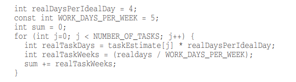
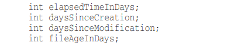
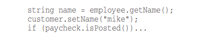

# CLEAN CODE

### 1. Đặt tên:

**đặt tên biến:**

-Việc sử dụng một tên biến tiết lộ ý định sẽ dễ dàng cho việc đọc và hiểu code, từ đó việc thay đổi code cũng sẽ dễ dàng hơn

-Một biến cần comment để giúp thể hiện ý nghĩa không phải là một cách đặt tên biến tốt.

-Nên sử dụng các danh từ đặt tên cho các biến.

-Các giá trị Searchable nên đặt thành một hằng số nhằm đảm bảo việc quản trị thay đổi sau này dễ dàng hơn.

-Tránh việc mã hóa ghi tắt làm người đọc rối.

-Ví dụ cho việc đặt tên biến đẹp:

**Đặt tên class và Object**

-Tên class và object phải là danh từ hoặc cụm danh từ (Vd: Customer, Animal)

-Tên class không nên là động từ

**Đặt tên cho method**

-Tên method nên là động từ hoặc cụm động từ (Vd: postPayment, saveUserInfomation,..)

-Khi constructors được overloads nhiều lần nên sử dụng factory với tên biểu diễn cho argument.

-Dùng những từ đơn giản mọi người đều hiểu để đặt cho method, "Don't Be Cute"

-Tránh sử dụng những từ có 2 nghĩa, hoặc sử dụng 2 từ cùng một nghĩa, điều này làm cho việc code dễ hiểu và đỡ rắc rối hơn.

